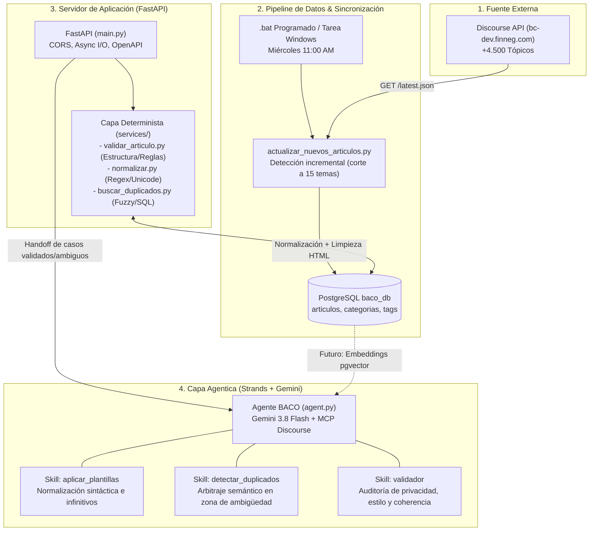
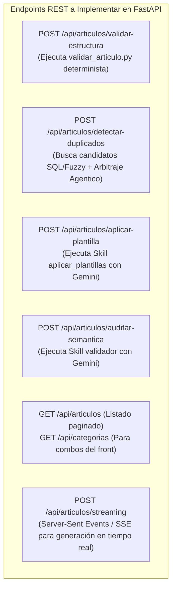

# BACO — Especificación Técnica y Arquitectura del Sistema
**Asistente Inteligente y Motor Editorial para la Base de Conocimiento Finnegans**
*Documento de referencia para el equipo de desarrollo e ingeniería*

---

## 1. Resumen Ejecutivo y Propósito del Proyecto

El proyecto **BACO** nace con el objetivo de optimizar, auditar y elevar la calidad editorial y técnica de los artículos publicados en la Base de Conocimiento de Finnegans (alojada en Discourse: [bc-dev.finneg.com](https://bc-dev.finneg.com)). 

En una organización con un ERP de alta complejidad y más de 4.500 artículos técnicos, los redactores, consultores y agentes de soporte enfrentan desafíos críticos:
- **Proliferación de duplicados y canibalización de búsquedas:** Coexistencia de artículos redundantes o, por el contrario, unificación errónea de artículos que corresponden a distintas jurisdicciones impositivas (ej. ARBA vs. CABA).
- **Heterogeneidad en la estructura:** Falta de apego a las plantillas estándar oficiales de Finnegans (*Instructivo* y *Soluciones*).
- **Riesgos de publicación y privacidad:** Filtración involuntaria de datos sensibles de clientes reales (CUITs, razones sociales, contraseñas, capturas de pantalla con información privada) o números de tickets de soporte internos.
- **Costos y límites de cómputo en IA:** Riesgo de sobreutilizar llamadas a Modelos de Lenguaje (LLMs) para tareas triviales que un algoritmo determinista resuelve en milisegundos.

Para resolver esto, BACO implementa una **arquitectura híbrida en dos capas**: una **capa determinista de alto rendimiento** (en el servidor con Python, PostgreSQL y expresiones regulares) que actúa como *gatekeeper*, y una **capa agentica basada en LLM y Skills NLP** (con Strands Agents y Google Gemini) que interviene exclusivamente en razonamiento semántico complejo y decisiones editoriales con supervisión humana (*Human-in-the-Loop*).



---

## 2. Stack Tecnológico Integral

A continuación se detalla cada una de las tecnologías empleadas en la solución actual, su versión/paquete y la justificación técnica de su elección:

| Tecnología / Biblioteca | Rol en el Proyecto | ¿Por qué se eligió? |
| :--- | :--- | :--- |
| **Python 3.12+** | Runtime principal del backend y scripts de datos. | Tipado estático moderno, rendimiento mejorado y soporte nativo para librerías asíncronas modernas. |
| **Strands Agents SDK** (`strands-agents`, `strands-agents-tools`) | Framework agentico modular. | Diseñado para orquestación de agentes con soporte nativo de **Skills** bajo especificación de carpetas (`SKILL.md` + `references/`), plugins desacoplados y conectores MCP. |
| **Google Gemini 3.8 Flash** (`google-genai`) | Modelo fundacional de lenguaje (LLM). | Gran velocidad de inferencia, amplia ventana de contexto y bajo costo por token, ideal para procesamiento editorial intensivo y síntesis de artículos largos. |
| **FastAPI** (`fastapi`) | Framework web para la API REST del backend. | Asincronismo nativo con `async/await`, validación estricta en tiempo de ejecución, alto rendimiento I/O y generación automática de contratos OpenAPI / Swagger. |
| **Uvicorn** (`uvicorn`) | Servidor ASGI para FastAPI. | Servidor ultrarrápido basado en `uvloop` y `httptools` para producción y desarrollo local. |
| **Pydantic v2** (`pydantic`) | Modelado y validación de esquemas de datos. | Validación rápida de payloads en Rust/Python (`ArticuloSchema`, `Tag`), garantizando que la estructura de los datos cumpla las reglas antes de llegar a la lógica de negocio. |
| **PostgreSQL 16+** | Base de datos relacional transaccional y analítica. | Motor ACID corporativo para almacenar el catálogo unificado de artículos, categorías y etiquetas. Listo para vectorización nativa mediante `pgvector`. |
| **Psycopg 3** (`psycopg`) | Driver nativo de PostgreSQL para Python. | Driver oficial de última generación con soporte para cursores del lado del servidor, sentencias preparadas eficientes, tipos nativos y pools de conexión asíncronos. |
| **Discourse REST API** & **Discourse MCP** (`mcp`) | Integración con la plataforma de conocimiento de Finnegans. | Consumo directo de tópicos vía HTTP (`/latest.json`, `/t/{id}.json`) e integración de herramientas agenticas mediante el Model Context Protocol (MCP). |
| **HTTPX** (`httpx`) | Cliente HTTP de última generación. | Soporta HTTP/1.1 y HTTP/2, pooling de conexiones, timeouts granulares y compatibilidad tanto sincrónica (scripts) como asincrónica (FastAPI). |
| **BeautifulSoup4** (`beautifulsoup4`) | Parseo y extracción de texto HTML. | Limpieza del campo `cooked` de Discourse, preservando saltos de línea y jerarquía de texto sin corromper la lectura. |
| **Unidecode / Unicodedata & RegEx** | Normalización determinista de strings. | Remoción de tildes, signos ortográficos y espaciados redundantes para comparación rápida y consistente de títulos y etiquetas. |
| **Windows Batch (.bat) & Task Scheduler** | Automatización programada de sincronización. | Ejecución periódica (miércoles 11:00 AM) desatendida en el entorno Windows con redirección completa de logs y códigos de error. |
| **python-dotenv** (`python-dotenv`) | Manejo seguro de configuración y secretos. | Lectura transparente de variables de entorno (`.env`) sin hardcodear claves de API ni credenciales de base de datos. |

---

## 3. Justificación de PostgreSQL (¿Por qué se eligió aunque aún no esté la matriz de embeddings?)

Durante las fases iniciales del proyecto se exploraron alternativas como archivos JSON planos (`articulos.json`) y bases vectoriales embebidas en SQLite como **ChromaDB**. Sin embargo, se migró a **PostgreSQL** (`baco_db`) como decisión estratégica y arquitectónica:

### 3.1. Limitaciones de los JSONs y de las bases vectoriales aisladas
1. **Pérdida de integridad relacional:** Los artículos en Discourse no son bloques de texto aislados; tienen categorías formales, múltiples etiquetas (tags), fechas de actualización y relaciones jerárquicas. Un JSON plano o una base vectorial pura no pueden garantizar claves foráneas ni integridad referencial si un tag o categoría cambia.
2. **Escalabilidad y concurrencia:** Manejar más de 4.500 artículos en un JSON de varios megabytes en memoria bloquea el hilo de ejecución, impide actualizaciones concurrentes y se corrompe con facilidad si un proceso falla a mitad de escritura.
3. **Búsquedas deterministas pobres:** Para filtrar por categoría, rango de fechas o slugs de tags, una base vectorial es ineficiente y lenta en comparación con un motor relacional indexado con índices B-Tree.

### 3.2. Ventajas inmediatas de PostgreSQL hoy en BACO
- **Transaccionalidad (ACID):** Las inserciones se realizan en bloques atómicos. Si un artículo falla en su descarga o parseo, se hace `ROLLBACK` y la base de datos queda intacta.
- **Estructura Normalizada:** Se cuenta con un esquema de 4 tablas vinculadas:
  - `categorias (id, nombre)`
  - `tags (id, name, slug)`
  - `articulos (id, titulo, categoria_id, url, texto, titulo_normalizado, actualizado, creado_en)`
  - `articulo_tags (articulo_id, tag_id)` con `ON DELETE CASCADE`.
- **Indexación especializada:** Índices en `categoria_id`, `actualizado`, `slug` y en la columna calculada `titulo_normalizado`, permitiendo consultas en menos de 2 milisegundos sobre 4.597 artículos.

### 3.3. Preparación futura con `pgvector` (La verdadera razón de fondo)
En lugar de fragmentar la infraestructura con un motor relacional para metadatos (ej. MySQL/SQLite) y otro servicio externo para vectores (ej. Pinecone o ChromaDB), **PostgreSQL resuelve ambos mundos con la extensión oficial `pgvector`**:
- Se añade una simple columna: `ALTER TABLE articulos ADD COLUMN embedding vector(768);` (o la dimensión del modelo de embeddings de Google/HuggingFace que se elija).
- **Búsqueda Híbrida (Hybrid Search) en una sola consulta SQL:** Permite combinar filtros deterministas de negocio con similitud semántica coseno:
  ```sql
  SELECT id, titulo, 1 - (embedding <=> :query_embedding) AS similitud
  FROM articulos
  WHERE categoria_id = 12
    AND actualizado >= '2026-01-01'
  ORDER BY embedding <=> :query_embedding
  LIMIT 5;
  ```
- **Índices HNSW / IVFFlat:** PostgreSQL indexa vectores de alta dimensionalidad de forma nativa en memoria, eliminando la necesidad de sincronizar dos bases de datos distintas.

---

## 4. Pipeline de Sincronización Incremental (`actualizar_nuevos_articulos.py`)

El script ubicado en `baco/server/discourse/actualizar_nuevos_articulos.py` resuelve la ingesta continua de novedades desde el foro de Discourse de Finnegans sin saturar la red ni la API.

### 4.1. Estrategia y Algoritmo de Corte Temprano (*Early Exit*)
A diferencia del descargador inicial masivo (`descargar_articulos.py`), este script aplica una estrategia incremental:
1. **Carga en memoria del set de IDs existentes:** Ejecuta `SELECT id FROM articulos;` y construye un `set` de Python (`ids_existentes`), permitiendo comprobaciones de pertenencia en $O(1)$.
2. **Paginación cronológica descendente:** Consulta el endpoint `/latest.json?order=created&page=N`, obteniendo los tópicos ordenados desde el más nuevo hacia el más antiguo.
3. **Corte a los 15 consecutivos (`MAX_CONSECUTIVOS_EXISTENTES = 15`):** 
   - A medida que desciende por la lista de tópicos, compara cada `tema_id` con el conjunto de IDs de la base.
   - Si encuentra un tema nuevo, lo procesa e inserta.
   - Si encuentra un tema que ya existe, incrementa un contador de consecutivos.
   - **En cuanto el contador llega a 15 temas seguidos existentes, el script deduce que ya alcanzó la frontera histórica donde la base estaba al día y aborta el bucle inmediatamente.** Esto ahorra cientos de peticiones HTTP innecesarias.

### 4.2. Resiliencia, Rate Limiting y Limpieza
- **Manejo inteligente de Rate Limits (HTTP 429):** La función `pedir()` intercepta cabeceras `Retry-After`. Si Discourse responde con 429, el script pausa exactamente los segundos requeridos por el servidor antes de reintentar.
- **Reintentos con Backoff Exponencial:** Para errores transitorios del servidor (HTTP 502, 503, 504), reintenta hasta 5 veces aumentando progresivamente el tiempo de espera.
- **Extracción limpia:** Usa `BeautifulSoup4` sobre el HTML renderizado (`cooked`) para garantizar que títulos, listas y párrafos conserven sus saltos de línea en lugar de convertirse en un único bloque de texto sin formato.
- **Normalización integrada:** Calcula al vuelo `titulo_normalizado` mediante `baco.server.services.normalizar` para que el artículo quede inmediatamente preparado para búsquedas deterministas.

---

## 5. Automatización con Script Batch (.bat) y Plan de Dockerización

Para mantener la base sincronizada de forma autónoma sin intervención humana, se desarrolló una rutina de automatización.

### 5.1. La Rutina `ejecutar_actualizacion.bat`
Ubicado en la raíz del proyecto, el archivo batch realiza las siguientes acciones:
1. Posiciona la consola en el directorio raíz del proyecto (`cd /d "C:\Users\ahreq\IdeaProjects\GeminiAgente"`).
2. Agrega una cabecera con la fecha y hora actual en `actualizar_articulos.log`.
3. Ejecuta el módulo de Python utilizando el ejecutable aislado del entorno virtual:
   ```cmd
   ".venv\Scripts\python.exe" -m baco.server.discourse.actualizar_nuevos_articulos >> "actualizar_articulos.log" 2>&1
   ```
4. Captura el código de retorno (`%ERRORLEVEL%`) e imprime la confirmación en el log.

### 5.2. Comando para los compañeros (Ejecución y Programación)

#### A. Ejecución manual inmediata (Prueba desde consola)
Cualquier compañero que tenga el proyecto clonado y el entorno virtual configurado puede ejecutar la sincronización con un solo comando:
```powershell
# Opción 1: Ejecutar directamente el archivo batch
.\ejecutar_actualizacion.bat

# Opción 2: Ejecutar el módulo mediante el entorno virtual
python -m baco.server.discourse.actualizar_nuevos_articulos
```

#### B. Comando para registrar la Tarea Programada en Windows (Miércoles 11:00 AM)
Para que se ejecute de forma automática todas las semanas en su propia máquina Windows, pueden crear la tarea con el siguiente comando en PowerShell (abierto como Administrador):
```powershell
schtasks /create /tn "BACO_Actualizar_Articulos" /tr "C:\Users\ahreq\IdeaProjects\GeminiAgente\ejecutar_actualizacion.bat" /sc weekly /d WED /st 11:00 /rl HIGHEST /f
```
*(Nota: Reemplazar la ruta absoluta por la ruta donde el compañero tenga clonado el repositorio).*

### 5.3. Dockerización Futura (Hacia la arquitectura de producción)
La automatización mediante `.bat` y Programador de Tareas de Windows es una solución práctica para el entorno de desarrollo local, pero presenta limitaciones:
- Depende de que la computadora esté encendida a las 11:00 AM.
- Utiliza rutas absolutas de Windows.
- Depende del runtime y las versiones locales del sistema operativo.

**Plan de migración a Docker:**
Se propone una arquitectura desacoplada en `docker-compose.yml`:
1. **Contenedor `baco-db`:** Imagen `pgvector/pgvector:pg16` para disponer de PostgreSQL con vectorización nativa lista.
2. **Contenedor `baco-api`:** Imagen ligera Python 3.12 con FastAPI sirviendo las peticiones del frontend.
3. **Contenedor `baco-worker` / Cron:** Contenedor Python que ejecuta un planificador interno (como Celery Beat, APScheduler o un demonio cron en Alpine Linux) para disparar `actualizar_nuevos_articulos.py` en base al horario configurado en variables de entorno, sin depender del host.

---

## 6. Separación de Capas: Determinista vs. Agentica

Una de las decisiones arquitectónicas más importantes del proyecto fue **erradicar las validaciones deterministas del ámbito de las Skills y del Prompt del LLM**, concentrándolas en la capa de servicios del servidor (`baco/server/services/`).

```mermaid
flowchart LR
    subgraph Entrada ["Texto / Borrador"]
        Doc[Borrador de Artículo]
    end

    subgraph CapaDeterminista ["Capa Determinista (Servidor / Python)"]
        V1["validar_articulo.py"]
        V2["Longitud >= 300 caracteres"]
        V3["Tags >= 2 (con instructivo o soluciones)"]
        V4["Título sin punto final / Sin 'Cómo...'"]
        V5["Marcadores pendientes [Indicar...]"]
        V6["Categoría obligatoria"]
    end

    subgraph Filtro ["Resultado Estructural"]
        Pasa{"¿Supera validación?"}
    end

    subgraph CapaAgentica ["Capa Agentica (Strands + Gemini)"]
        S1["validador: Privacidad / PII / CUITs reales"]
        S2["validador: Coherencia conceptual ERP"]
        S3["aplicar_plantillas: Modo infinitivo y markdown"]
        S4["detectar_duplicados: Arbitraje en zona de ambigüedad"]
    end

    Doc --> CapaDeterminista
    CapaDeterminista --> Pasa
    Pasa -- "No (Bloqueante)" --> Rechazo["Rechazo instantáneo (0 ms) con lista de hallazgos"]
    Pasa -- "Sí (Válido o Requiere Ajuste)" --> CapaAgentica
```



### 6.1. ¿Por qué NO hacer todo con el Agente / LLM?
1. **Costo computacional y financiero:** Consultar a Gemini o a cualquier LLM para verificar si un texto tiene al menos 300 caracteres o si termina en punto final cuesta tokens y dinero innecesario.
2. **Latencia extrema:** La validación determinista en Python tarda **0.5 milisegundos**. Una llamada a la API de un LLM toma entre **800 ms y 3.500 ms**.
3. **Determinismo vs. Probabilidad:** Los LLMs son probabilísticos; pueden "pasar por alto" reglas sintácticas estrictas o alucinar que un tag está presente cuando no lo está. Una función en Python es 100% binaria y predecible.
4. **Protección contra saturación de cuotas (Rate Limits 429/503):** Al filtrar los borradores incompletos o mal formados en el servidor, se evita llamar al LLM con datos basura.

### 6.2. Matriz de Responsabilidades

| Aspecto a Validar / Procesar | Capa Responsable | Mecanismo Técnico |
| :--- | :--- | :--- |
| Presencia obligatoria de Título y Categoría | **Determinista** | `validar_articulo.py` (Chequeo directo de atributos) |
| Longitud mínima de texto (>= 300 caracteres) | **Determinista** | `len(texto.strip()) >= 300` |
| Cantidad de tags (>= 2) y presencia de tag de tipo | **Determinista** | Verificación de pertenencia en sets (`'instructivo'`, `'soluciones'`) |
| Título: sin punto final y sin fórmulas ("Cómo...") | **Determinista** | Expresiones regulares (`re.match`, `re.search`) |
| Detección de marcadores pendientes (`[Indicar ...]`) | **Determinista** | Regex `r"\[Indicar[^]]*\]"` |
| Búsqueda inicial de títulos idénticos o cuasi-idénticos | **Determinista** | SQL sobre `titulo_normalizado` y algoritmos de distancia de Levenshtein |
| **Detección de datos privados (PII, CUITs, clientes reales)** | **Agentica (Skill: validador)** | Comprensión semántica y contextual de entidades nombradas |
| **Detección de tokens, claves o tickets de soporte internos** | **Agentica (Skill: validador)** | Reconocimiento de jerga y números de ticket en contexto |
| **Coherencia causa-efecto (¿los pasos resuelven el error?)** | **Agentica (Skill: validador)** | Razonamiento lógico sobre el flujo del problema y la solución |
| **Redacción en infinitivo y reestructuración de plantilla** | **Agentica (Skill: aplicar_plantillas)** | Síntesis editorial, eliminación de muletillas y reformulación sintáctica |
| **Arbitraje de duplicados en variantes paramétricas** | **Agentica (Skill: detectar_duplicados)** | Comprensión de normativas ERP (ARBA vs. CABA, Compras vs. Ventas) |

---

## 7. Skills Desarrolladas y sus Criterios de Dominio

Las tres skills se encuentran implementadas bajo la convención estándar en la carpeta `baco/skills/`. Cada skill contiene su respectivo archivo descriptivo `SKILL.md` y una subcarpeta `references/` con ejemplos y pautas.

### 7.1. Skill: `aplicar_plantillas`
- **Misión:** Actúa como motor de transformación semántica y estilística para redactar artículos bajo el estándar de Finnegans.
- **Reglas operativas esenciales:**
  1. **Modo infinitivo estricto:** Convierte instrucciones redactadas en imperativo o segunda persona (*"ingresá a ventas y hacé clic"*) a infinitivo neutro (*"Ingresar a ventas y hacer clic"*).
  2. **Cero alucinación (Fidelidad factual):** Prohibido inventar rutas, botones, módulos o pantallas que no figuren en el borrador original.
  3. **Marcadores explícitos:** Si el borrador omite un dato indispensable para completar el procedimiento, la skill inserta un marcador `[Indicar ...]` para que el redactor lo complete manualmente.
  4. **Salida limpia:** Devuelve exclusivamente el Markdown del artículo final, sin preámbulos conversacionales (*"Hola, aquí tienes el artículo..."*) ni fichas redundantes.
- **Estructuras admitidas:**
  - **Instructivo:** Secciones `## Objetivo`, `## Alcance (Qué hace y qué no hace)`, `## Requisitos previos`, `## Procedimiento paso a paso`, `## Resultado esperado`.
  - **Soluciones:** Secciones `## Consulta` (con síntoma y error textual entre comillas), `## Respuesta` (causa raíz conceptual, sin pasos), `## Pasos a seguir` (secuencia numerada en infinitivo). Incluye condicionalmente `## Requiere AppBuilder` si aplica.

### 7.2. Skill: `detectar_duplicados`
- **Misión:** Arbitrar casos ambiguos que hayan superado el filtro determinista inicial, evitando tanto la redundancia innecesaria como la unificación destructiva de procedimientos distintos.
- **Principio Human-In-The-Loop (HITL):** El agente nunca elimina ni fusiona artículos por su cuenta; entrega un dictamen estructurado y formula opciones para que el editor humano tome la decisión final.
- **Taxonomía de casos del dominio ERP Finnegans:**
  1. **Duplicado Real:** Mismo objetivo de negocio (*Job-to-be-Done*) y mismo procedimiento redactado con palabras distintas o singular/plural. *Acción: Unificar.*
  2. **Variante Paramétrica (¡El caso más crítico!):** Pantallas y pasos casi idénticos pero con regímenes impositivos, jurisdicciones o países distintos (ej. *Retenciones IIBB ARBA* vs. *Retenciones IIBB CABA*; *Factura Electrónica Argentina* vs. *Facturación Uruguay*). **Fusionar estos artículos provocaría que un cliente aplique una configuración fiscal errónea en su sistema.** *Acción: Mantener estrictamente separados.*
  3. **Flujo Complementario u Opuesto:** Misma entidad de negocio pero etapas cronológicas opuestas (ej. *Factura de Compra* vs. *Factura de Venta*, *Liquidación Primaria* vs. *Secundaria*). *Acción: Mantener separados con enlaces cruzados.*
  4. **Relación Jerárquica:** Un artículo general sobre el módulo frente a un artículo puntual sobre un error o solapa específica. *Acción: Mantener separados o sugerir integración como acápite.*
- **Salida estructurada obligatoria:** Dictamen, Nivel de Confianza, Análisis de Divergencia Semántica, Riesgo Operativo y Opciones Accionables (Recomendada y alternativas).

### 7.3. Skill: `validador`
- **Misión:** Auditoría de excelencia editorial, seguridad de la información y coherencia técnica previa a la publicación.
- **Ejes de auditoría:**
  1. **Publicación Segura y Privacidad (Detección de PII):** Detección proactiva de CUITs reales, razones sociales de clientes reales, correos electrónicos corporativos, credenciales, URLs de entornos internos o menciones a tickets de soporte (*"Ticket #94821"*).
  2. **Calidad Semántica del Título:** Verificar que exprese la acción y el contexto en el ERP de forma clara y unívoca.
  3. **Coherencia Conceptual:** Validar que el procedimiento técnico pertenezca realmente a la categoría asignada (ej. que una configuración de sueldos no esté en la categoría de cuentas a cobrar).
  4. **Coherencia Causa-Efecto:** Constatar que los pasos descritos solucionen efectivamente el mensaje de error o problema expuesto.

---

## 8. ¿Qué es FastAPI, Estado Actual y Qué Falta Implementar?

### 8.1. ¿Qué es FastAPI?
**FastAPI** es un framework web moderno y de muy alto rendimiento para construir APIs con Python basado en estándares abiertos:
- **Asincronía nativa (`async` / `await`):** A diferencia de frameworks sincrónicos como Flask tradicional o Django clásico, FastAPI está construido sobre **Starlette**, lo que le permite manejar miles de conexiones concurrentes en espera de I/O (consultas a base de datos o llamadas a la API de Gemini) sin bloquear hilos.
- **Tipado estático con Pydantic:** Los datos entrantes se validan automáticamente con las clases de Pydantic. Si un cliente envía un JSON inválido, FastAPI responde automáticamente con un error HTTP 422 claro y estructurado.
- **Documentación OpenAPI interactiva:** Genera de forma automática una interfaz web Swagger UI accesible en `/docs` donde cualquiera puede probar los endpoints sin necesidad de Postman.

### 8.2. Estado Actual de la API (`baco/server/app/main.py`)
En el estado actual del repositorio, el archivo `main.py` contiene:
- Inicialización de la aplicación FastAPI (`app = FastAPI()`).
- Configuración de `CORSMiddleware` para habilitar peticiones desde clientes locales (`localhost` y `127.0.0.1`).
- Endpoint de verificación de salud (*healthcheck*): `GET /` devolviendo `{"message": "Es reactiva? Si xd"}`.
- Bloque de ejecución con Uvicorn en el puerto `8080`.
- Anotaciones sobre manejo de sesiones con Redis para persistencia de borradores.

### 8.3. Qué falta implementar en FastAPI (Hoja de Ruta del Backend)

Para conectar el frontend y completar la arquitectura de BACO, resta implementar los siguientes módulos y rutas en FastAPI:



1. **Endpoints de Validación Determinista (Rápidos):**
   - `POST /api/articulos/validar-estructura`: Recibe el borrador en un payload `ArticuloSchema` y devuelve de inmediato el JSON de `validar_estructura_articulo()` con la lista de `findings` (severidad, campo, descripción y acción sugerida).
2. **Endpoints Agenticos de Transformación y Auditoría:**
   - `POST /api/articulos/aplicar-plantilla`: Invoca al agente Strands activando la skill `aplicar_plantillas` y retorna el cuerpo en Markdown normalizado.
   - `POST /api/articulos/auditar-semantica`: Invoca la skill `validador` sobre el artículo y devuelve el informe de privacidad, título, coherencia y estilo.
3. **Endpoint Híbrido de Duplicados:**
   - `POST /api/articulos/analizar-duplicados`:
     - *Fase 1 (Determinista):* Normaliza el título y busca coincidencias en `baco_db` con similitud de texto mayor al 70%.
     - *Fase 2 (Agentica):* Si hay coincidencias moderadas/ambiguas, pasa el par sospechoso a la skill `detectar_duplicados` y devuelve el dictamen estructurado para el usuario.
4. **Streaming en Tiempo Real (Server-Sent Events - SSE):**
   - Como las respuestas de los LLMs en artículos extensos pueden demorar varios segundos, es necesario implementar un endpoint con streaming para que el usuario en el frontend vea el texto generándose palabra por palabra en lugar de ver una pantalla de carga congelada.
5. **Persistencia de Borradores y Manejo de Sesión:**
   - Endpoint para guardar borradores en progreso (`drafts`) en PostgreSQL o Redis para que el usuario no pierda su trabajo si recarga la página.
6. **Manejo Global de Excepciones y Modelos de Respuesta:**
   - Estandarizar respuestas de error con códigos HTTP semánticos (400 Bad Request, 404 Not Found, 422 Unprocessable Entity, 500 Internal Server Error) y contratos Pydantic para la documentación en Swagger.

---

## 9. Guía de Puesta en Marcha Rápida para el Equipo

Para que cualquier miembro del equipo clone y ejecute el proyecto en su máquina:

### Paso 1: Clonar y configurar variables de entorno
```bash
git clone https://github.com/carolina-gonzalez-129/baco.git
cd baco
```
Crear un archivo `.env` en la raíz tomando como base las credenciales del equipo:
```env
DB_HOST=localhost
DB_PORT=5432
DB_USER=postgres
DB_PASSWORD=tu_contraseña
DB_NAME=baco_db

DISCOURSE_API_KEY=tu_api_key_de_discourse
DISCOURSE_API_USERNAME=system
DISCOURSE_URL=bc-dev.finneg.com

GEMINI_API_KEY=tu_api_key_de_gemini
PROFILE=tu_perfil_mcp
```

### Paso 2: Crear entorno virtual e instalar dependencias
```powershell
python -m venv .venv
.\.venv\Scripts\activate
pip install -r requirements.txt
```

### Paso 3: Inicializar la Base de Datos PostgreSQL
Asegurarse de tener PostgreSQL corriendo localmente y ejecutar:
```powershell
python -m baco.server.db.cargar_articulos_postgres
```
*Esto verificará o creará `baco_db`, generará las 4 tablas con sus claves foráneas e índices, e importará el set de datos inicial si está disponible.*

### Paso 4: Probar la Sincronización Incremental
```powershell
python -m baco.server.discourse.actualizar_nuevos_articulos
```

### Paso 5: Levantar el Servidor FastAPI
```powershell
uvicorn baco.server.app.main:app --reload --host localhost --port 8080
```
Abrir el navegador en [http://localhost:8080/docs](http://localhost:8080/docs) para ver la documentación interactiva Swagger.

---
*Documento elaborado para el equipo de desarrollo de BACO.*
